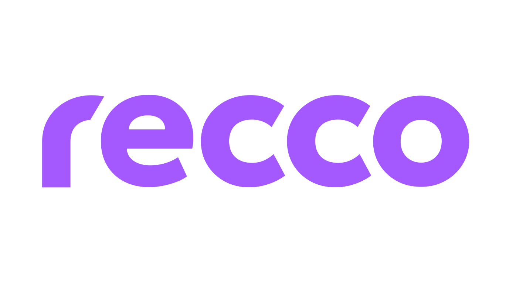

# Recco Flutter Plugin

This repository holds the codebase for the Recco Flutter plugin. Instructions on how to add and use this plugin can be found in the [Usage](#usage) section.

You are more than welcome to install the [APK](#demo) to start playing around with the product, or clone the repository and compile it on your own if you feel like it. 

However, please be aware that in order to actually integrate it into your own application, you will first need to contact our sales team to initiate the license acquisition process. For that purpose, please send an email to `recco@significo.com`.

# Overview

Personalized, and user-friendly approach to health and wellness recommendations based on users' unique interests, motivations, and health behaviors. Whether they are looking to improve their fitness, manage their stress, or simply lead a more fulfilling life. __`Recco` is designed to help them reach their full potential.__

Learn more about Recco SDK:

- [Recco SDK Android][Recco SDK Android]
- [Recco SDK iOS][Recco SDK iOS]

## Usage

Add this to pubspec.yaml

```yml
dependencies:
  recco: 0.0.0
```

## Initialize Recco in Android

Create an Application.kt class in your Android project, reference it in your Application Manifest.xml file and add the following code:

```kotlin
// Follow demo example to add Hilt Dependency.

@HiltAndroidApp
class ShowcaseApp : FlutterApplication() {
    override fun onCreate() {
        super.onCreate()

        ReccoApiUI.init(
            sdkConfig = ReccoConfig(
                apiSecret = <YOUR_API_SECRET>
            ),
            application = this
        )
    }
}
```


## Initialize Recco in iOS

Inside your iOS application AppDelegate, add the following code:

```swift
override func application(
        _ application: UIApplication,
        willFinishLaunchingWithOptions launchOptions: [UIApplication.LaunchOptionsKey: Any]?
    ) -> Bool {
        ReccoUI.initialize(clientSecret: <YOUR_API_SECRET>)
        return super.application(application, willFinishLaunchingWithOptions: launchOptions)
    }
```
## ReccoPlugin new Instance

```dart
final Recco _reccoPlugin = Recco();
```

## Login

```dart
Future<String> _loginReccoSDK(String userId) async {
    try {
        _reccoPlugin.login(userId);
    } on PlatformException catch (e) {
        debugPrint("Error: '${e.message}'.");
    }
    return userId;
}
```

## Logout

```dart
Future<void> _logoutReccoSDK() async {
    try {
      _reccoPlugin.logout();
    } on PlatformException catch (e) {
      debugPrint("Error: '${e.message}'.");
    }
}
```

## OpenReccoUi

```dart
Future<void> _openReccoUI() async {
    try {
      _reccoPlugin.openReccoUI();
    } on PlatformException catch (e) {
      debugPrint("Error: '${e.message}'.");
    }
}
```

[Recco SDK Android]:https://github.com/sf-recco/android-sdk
[Recco SDK iOS]:https://github.com/sf-recco/ios-sdk